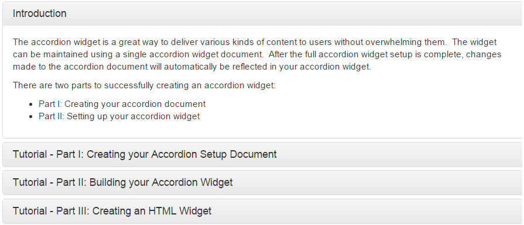
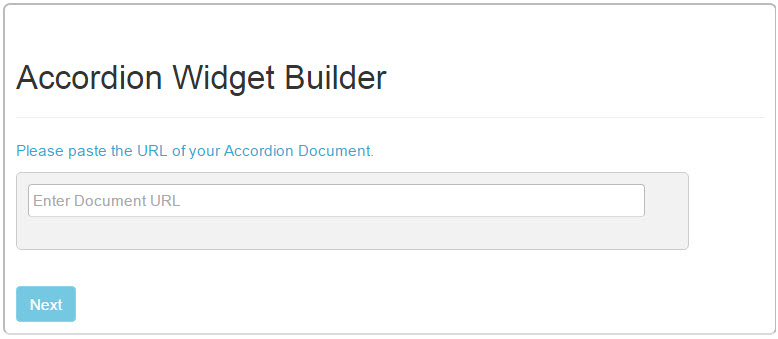

Jive - Accordion Widget
=======================

The accordion widget is a great tool for organizing content on your overview page.  This is a [Jive](https://community.jivesoftware.com/welcome) HTML widget project that allows content to be divided into sections, and users can expand and collapse sections as desired to view information.  Users can serve themselves to the content on a page without being overwhelmed by everything being displayed at once.  The widget is maintained using a single setup document, which is simply a Jive document with a table representing how the widget will display the information.  After the full accordion widget setup is complete, changes made to the accordion document will automatically be reflected in the accordion.  The accordion utilizes [Bootstrap panels](http://getbootstrap.com/components/#panels) to create a clean user interface for the accordion.

Prerequisite
------------
The [Content Lookup](https://github.com/fmr-llc/jive-content-lookup) widget installation has essential parts of setting up this widget project.  Make sure to install this widget prior to the accordion installation.

Upload Libraries
----------------
* Extract the accordion widget zip archive to your local computer.
* (Optional) Perform any required security checks on the downloaded code.
* Log into your Jive community.
* Navigate to the upload location for your library files.
* Create another Uploaded File in the Library location of your Jive community.  Drag the file "accordion_widget.css" to the file section of the upload.  Set the file name to "Accordion Widget CSS Library", put a description of your choosing, tag it, set the authors, and make sure it is being published to the correct Library location.  Click Publish.
* Create another Uploaded File in the Library location of your Jive community.  Drag the file "accordion_widget.js" to the file section of the upload.  Set the file name to "Accordion Widget JavaScript Library", put a description of your choosing, tag it, set the authors, and make sure it is being published to the correct Library location.  Click Publish.
* Create another Uploaded File in the Library location of your Jive community.  Drag the file "accordion_widget_builder.css" to the file section of the upload.  Set the file name to "Accordion Widget Builder CSS Library", put a description of your choosing, tag it, set the authors, and make sure it is being published to the correct Library location.  Click Publish.
* Create another Uploaded File in the Library location of your Jive community.  Drag the file "accordion_widget_builder.js" to the file section of the upload.  Set the file name to "Accordion Widget Builder JavaScript Library", put a description of your choosing, tag it, set the authors, and make sure it is being published to the correct Library location.  Click Publish.

Update Library Loader
---------------------
* Use the Content Lookup widget to search for "Library Loader".  Click the link to the file in the results.  If it is not found, contact your administrator and go over these instructions.
* Download a copy of the "Library Loader" file from your community.  Open it for editing.
* Go back to the Content Lookup widget and search for "Accordion Widget".  You should see the four library files you uploaded to your community in the previous section.
* Find the search result for "Accordion Widget CSS Library" and copy its Content ID.  It should be a number like 694225.
* Update the library_loader.js file line for "accordion_widget.css" and update the content ID variable (it should be 0 before updating) to the Content ID copied in the previous step.  The result should look similar to:
```
	libraries['accordion_widget.css'] = { contentID: '694225' };
```
* Find the search result for "Accordion Widget JavaScript Library" and copy its Content ID.  It should be a number like 694226.
* Update the library_loader.js file line for "accordion_widget.js" and update the content ID variable (it should be 0 before updating) to the Content ID copied in the previous step.  The result should look similar to:
```
	libraries['accordion_widget.js'] = { contentID: '694226' };
```
* Find the search result for "Accordion Widget Builder CSS Library" and copy its Content ID.  It should be a number like 694227.
* Update the library_loader.js file line for "accordion_widget_builder.css" and update the content ID variable (it should be 0 before updating) to the Content ID copied in the previous step.  The result should look similar to:
```
	libraries['accordion_widget_builder.css'] = { contentID: '694227' };
```
* Find the search result for "Accordion Widget Builder JavaScript Library" and copy its Content ID.  It should be a number like 694228.
* Update the library_loader.js file line for "accordion_widget_builder.js" and update the content ID variable (it should be 0 before updating) to the Content ID copied in the previous step.  The result should look similar to:
```
	libraries['accordion_widget_builder.js'] = { contentID: '694228' };
```
* Save the changes to the library_loader.js file on your computer.
* Edit the "Library Loader" uploaded file in your Jive community.
* Drag the updated file from your computer to the file section of the uploaded file.
* Click Publish.

You have now updated the Library Loader in your Jive community with the library files needed to run the accordion builder and widgets.  Next, we need to change the Accordion builder code to use the Library Loader in your community.

Install the Accordion Widget Builder application
---------------------------------------------------
* Use the Content Lookup widget to search for "jQuery Library".  Copy the Content ID.  It should be a number like "694224"
* Look in the accordion widget archive on your computer and edit the "accordion_widget_builder.html" file.
* Find the jquery_content_id and replace the zero in the quotes with that Content ID.  The result should look similar to:
```
	var jquery_content_id = "694224";
```
* Go back to the Content Lookup widget and get the Binary URL for "jQuery Library".  It should look similar to:
```
	https://myjiveinstance.mycompany.com/api/core/v3/attachments/file/694224/data
```
* Edit the "content_lookup.html" file again.
* Find the line:
```
    <script src='JQUERY'></script>
```
&nbsp;&nbsp;&nbsp;&nbsp; replace the text JQUERY with that Binary URL you copied.  It should end up looking similar to:
```
    <script src='https://myjiveinstance.mycompany.com/api/core/v3/attachments/file/694224/data'></script>
```
* Go back to the Content Lookup widget and search for "Library Loader".  Copy the Content ID.  It should be a number, like "694223"
* Edit the "content_lookup.html" file again.
* Find the library_loader_content_id and replace the zero in the quotes with that Content ID.  The result should look similar to:
```
	var library_loader_content_id = "694223";
```
* Save the edit to the "accordion_widget_builder.html" file.
* Go to the site you want to put the Accordion Builder application in your community, and go to the Overview page.
* Manage the Overview page, and drag a new HTML widget onto the page.
* Edit the new HTML Widget.
* Copy the updated code from "accordion_widget_builder.html" and paste it into the "Your HTML" entry field in the new widget.
* Click "Save Properties".
* Click "Publish Layout".

Your Accordion Widget Builder is now set up.  Site admins can use the below instructions to create their own accordions...

Creating an accordion setup document
------------------------------------
* Create a document in a place that users will have at least read access.
* Create a table with two columns.  Make sure you add exactly two columns, and have one row per tab in your accordion.
* The left column represents the accordion headers (titles) and the right column represents the body (content) in the expanded panel.  For clarity, name the headers (the first row) to “Header” and “Body” to make the column functions clear.  Each row you add to the table represents another accordion section.
<b>NOTE: Quotes and code blocks are stripped down to plain text formatting. Content and headers will be left-aligned. Do not use the “Style” option from the text editor menu, as its Jive specific styling is not supported.</b>
The content section can include pictures, videos, animated GIFs, and other content.  Just avoid using the Jive editor styles, as these are not supported by the accordion code.
| Title | Content |
| :-----| :-----: |
| Introduction      | The accordion widget is a great way to deliver various kinds of content to users without overwhelming them. |
| Part I: Creating your accordion document | Content for Part I here... |
| Part II: Setting up your accordion widget | Content for Part II here... |
* Once your accordion setup document is completed, publish the document.  Once it is published, copy the URL to use in the builder application.

Build an accordion widget
-------------------------
* Go to the Accordion Widget Builder application.
* Paste the URL to the accordion setup document in the entry field.  Click Next.
* Pick the color you want the accordion tabs.
* Select how the accordion is first presented.  Press Next.
* The accordion code will be generated and highlighted in the code box.  Press Ctl-C to copy it to the clipboard.
* Go to the Overview page you want the accordion.
* Manage the Overview page.
* Drag a new HTML Widget into one of the columns on the page.
* Edit the widget and paste the code from the previous section.
* Click Save Properties.
* Publish the page.

Usage
-----
Once the accordion is setup and operational, users can expand and collapse the sections to show/hide the contained information.
If changes are need to the accordion, the setup document can be edited and the changes will be picked up the next accordion refresh.

Issues
------
If your widget is not working as expected, please check out [Issues](docs/issues.md)

Additional Jive-n widget projects in this series
------------------------------------------------
* [Content Lookup](https://github.com/fmr-llc/jive-content-lookup)
* [Content Viewer widget](https://github.com/fmr-llc/jive-content-viewer)
* [Export widget](https://github.com/fmr-llc/jive-export-followers)
* [Form widget](https://github.com/fmr-llc/jive-form)
* [Form Report widget](https://github.com/fmr-llc/jive-form-report)
* [Menu Bar widget](https://github.com/fmr-llc/jive-menu)
* [Picture Carousel widget](https://github.com/fmr-llc/jive-picture-carousel)
* [Presentation widget](https://github.com/fmr-llc/jive-presentation)
* [Search widget](https://github.com/fmr-llc/jive-advanced-search)
* [Team Listing widget](www.github.com/fmr-llc/jive-team-listing)

Contributing
------------
If you would like to contribute to this project, please check out [Contributing](docs/contributing.md)

License
-------
(c) 2015 Fidelity Investments
Licensed under the [Apache License](docs/LICENSE), Version 2.0